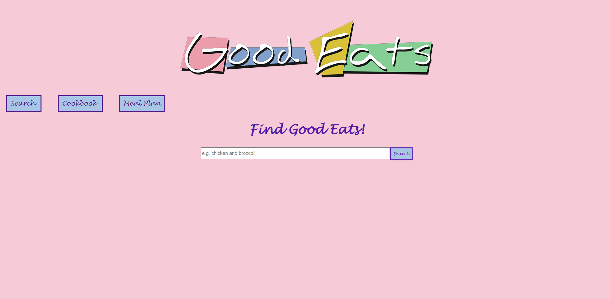
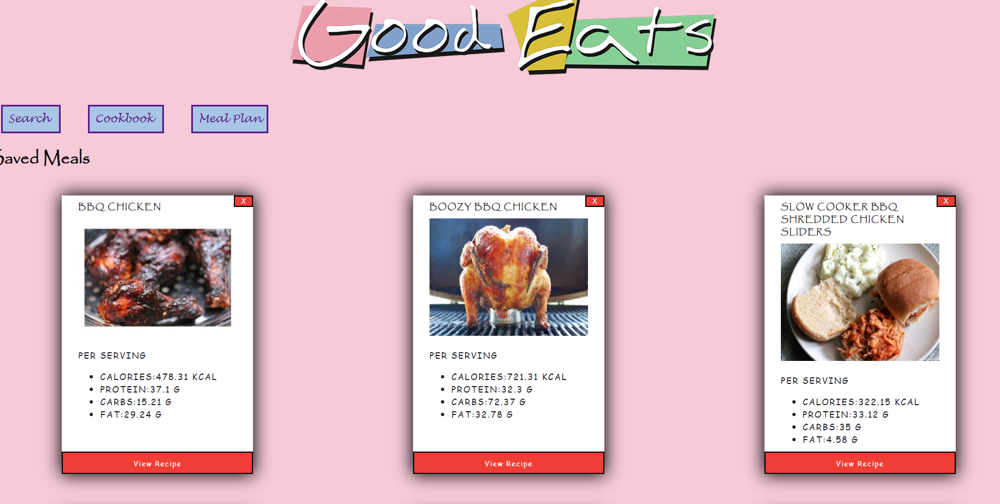

# Good Eats

Inspired by nostalgia of Alton Brown and a personal desire to improve meal planning efforts, this project is meant to help create reference meal plans by accessing the Spoonacular API (https://spoonacular.com/food-api/). 

Through Spoonacular, users can search a database of over 5,000 recipes and save these recipes to a personal cookbook. Once saved, each recipe has its own recipe page which includes ingredients, serving size, macros per serving, and instructions provided by the API.[^1] This application then allows for the creation of a simple workweek meal plan that tracks the intake of the major macros; protein, carbs, fats, and calories. 

[^1]: Note unfortunately some recipes in the API are unstandardized in their formatting or otherwise incomplete. These cases are not currently accounted for in this application.

## Find Some Good Eats
When the application is launched, users land at the search component. Here they can type in search criteria to search for recipes in the Spoonacular API. 

 

The API will return any recipes it finds that match the user's search criteria. Card elements are rendered based on these results and contain the recipe's name, picture, and macros information. Users can save any recipe found here into a personal cookbook by pressing the 'Add to Cookbook' button. Doing so will save the recipe by making a fetch post request. Additional information regarding the recipe's instructions, ingredients, etc., is also requested from the API upon adding to the cookbook.

## Cookbook
The cookbook component lists all recipes saved on the server. Users are able to remove recipes from their cookbook using the 'X' button, and can view the recipe in detail using the 'View Recipe' button. 

Each recipe page is rendered using information gathered from Spoonacular. Recipe cards will contain an ingredient list, macros per serving, total servings made, instructions, as well as a title and picture.

## Meal Plan

In the Meal Plan component, users can add recipes to their specified day of the week and meal time. Each entry can be denoted with the amount of servings and each day tracks the total amount of macros based on user inputs.

## Future Additions

This application is definitely limited in its utilization of the Spoonacular API. Using the free version, there is a limited amount of requests this application can make to the API which prevents ease of use for more complicated search criteria (allergies, preferences, macro specifications) which IS supported by the API itself. Additionally, some users may already be know the macros of personal recipes or would otherwise benefit from being able to add custom 'recipes' for snack foods rather than full meals. Future features could include the implementation of these advanced search criteria, the ability to create and save multiple meal plans, and add custom recipes/individual snacks.